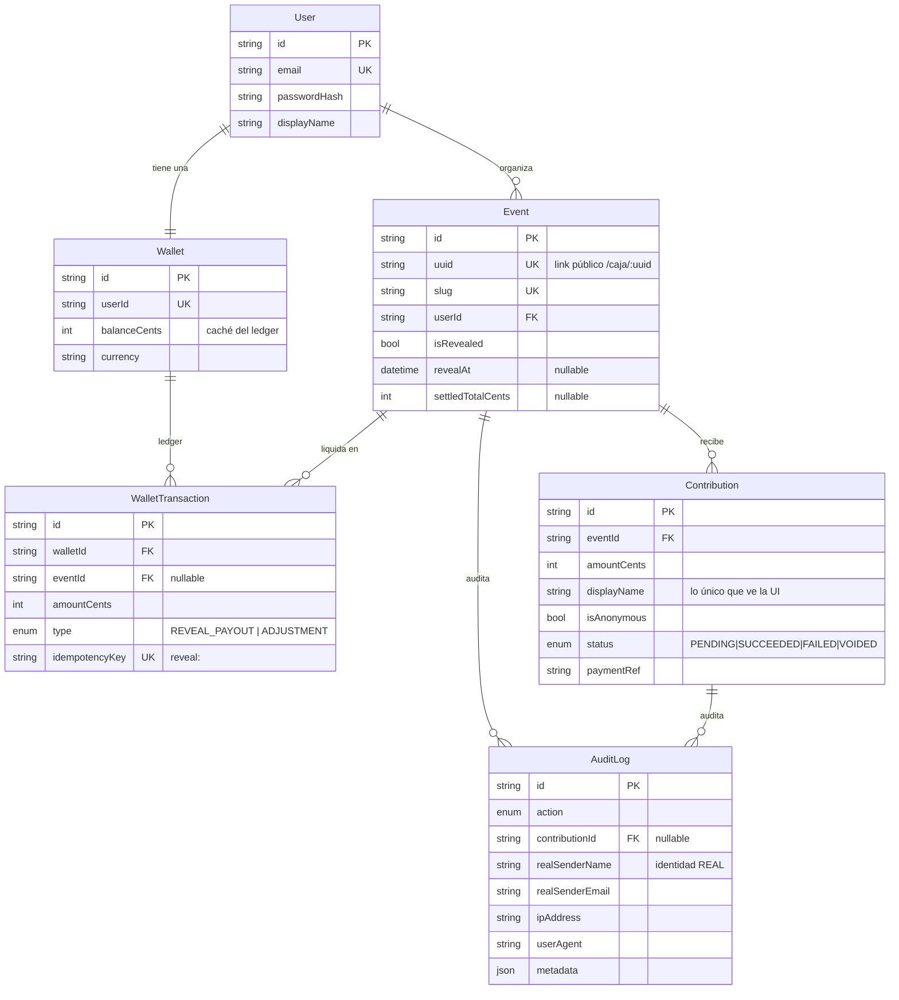

# Arquitectura — VaqCash v2

## 1. Modelo de datos



### Las tres decisiones que sostienen el modelo

**El anonimato es de presentación, no de almacenamiento.** `Contribution.displayName`
es lo único que la UI puede pintar; cuando el aporte es anónimo vale literalmente
"Anónimo". La identidad real, la IP y el user-agent viven en `AuditLog`, que no se
expone por ninguna ruta de la API. Separar las dos tablas es lo que hace imposible
filtrar por descuido: no existe un campo "nombre real" que un presenter distraído
pueda serializar.

**El balance de la wallet es un caché, no la verdad.** La verdad contable es la suma
de `WalletTransaction`. Si el balance y el ledger discrepan, gana el ledger y el
balance se reconstruye. Guardar solo un entero mutable en `Wallet` haría imposible
auditar de dónde salió el dinero.

**La idempotencia es una restricción de base, no una comprobación en código.**
`WalletTransaction.idempotencyKey` es `UNIQUE` y vale `reveal:<eventId>`. Dos
revelaciones simultáneas pueden pasar cualquier chequeo en memoria; ninguna puede
violar un índice único. El pago es exactamente-una-vez porque Postgres lo impone.

## 2. Estructura de carpetas

### Backend (Clean Architecture)
```
src/
  domain/                    reglas puras. Cero express, cero prisma.
    policies/reveal.policy.ts
    errors.ts
    ports/                   PaymentGateway, QrGenerator, Clock, repositorios
  application/               casos de uso. Solo importan domain.
    use-cases/               RegisterUser, CreateEvent, ProcessContribution,
                             RevealAndSettle, GetDashboard, GetWallet
  infrastructure/            adaptadores concretos
    persistence/prisma/      implementaciones de los repositorios
    payments/                fake-payment-gateway
    qr/                      generador de QR
    auth/                    hash de password + JWT
  interfaces/http/           controllers, routes, middlewares, presenters
```
La regla de dependencia apunta siempre hacia dentro. Un caso de uso que importe
`PrismaClient` está mal escrito: debe recibir el puerto. Esto es lo que permite
cambiar la pasarela simulada por una real sin tocar una sola regla de negocio.

### Frontend
```
src/
  app/            router, providers, tema
  features/       una carpeta por capacidad de producto
    auth/  boxes/  checkout/  wallet/
  shared/
    api/          cliente y tipos del contrato
    ui/           primitivas del sistema de diseño
    hooks/
  mocks/          handlers MSW que implementan API.md
```

## 3. Estrategia de link compartible y QR

**El link.** `Event.uuid` es un UUID v4 independiente del `id` interno, y es lo único
que viaja en `/caja/:uuid`. Separarlos evita dos cosas: que el link revele un id
secuencial o enumerable, y que cambiar el identificador público obligue a tocar claves
foráneas. El `slug` se conserva solo para legibilidad interna.

**El QR.** Se genera en el **backend**, no en el navegador, con la librería `qrcode`,
como data URL PNG que codifica `${PUBLIC_WEB_URL}/caja/:uuid`. Tres razones:

1. El QR y el link salen de la misma fuente de verdad, así que no pueden divergir.
2. El organizador puede descargarlo o incrustarlo en una invitación impresa sin que
   haga falta un navegador que lo dibuje.
3. `PUBLIC_WEB_URL` es obligatoria en producción, de modo que un despliegue mal
   configurado falla al arrancar en vez de generar QR que apuntan a `localhost`.

Se devuelve en `POST /events` y en `GET /events/:id/qr`.
